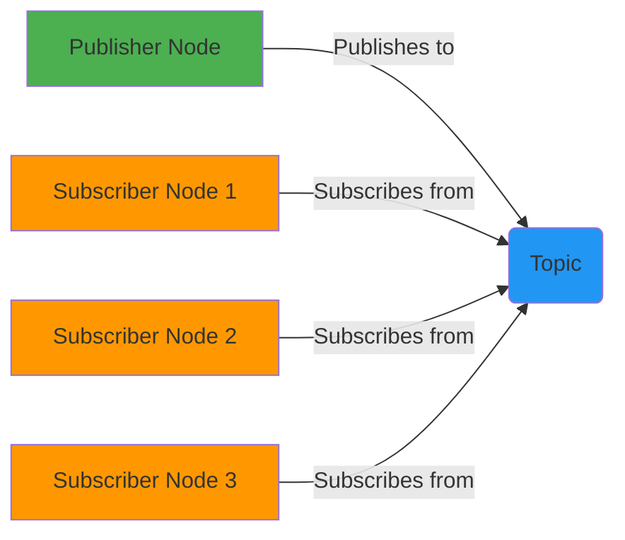

# Module 1 Assessment

## Learning Outcomes

After completing this assessment, you will be able to:
1. Demonstrate understanding of ROS 2 core concepts: Nodes, Topics, and Services
2. Apply knowledge of rclpy to create simple publisher/subscriber nodes
3. Interpret basic URDF files for humanoid robots
4. Connect theoretical concepts to practical applications

## Assessment Overview

This assessment evaluates your understanding of the core concepts covered in this module. It includes multiple-choice questions, a diagram labeling exercise, and a hands-on coding task to apply your knowledge.

## Part 1: Multiple Choice Questions

### Question 1
What is the primary purpose of a Node in ROS 2?
A) To store robot configuration data
B) To serve as the basic computational unit that performs specific tasks
C) To manage network connections
D) To store sensor calibration parameters

### Question 2
In the publish-subscribe communication pattern:
A) The publisher waits for a response from subscribers
B) Subscribers send requests to publishers
C) Publishers send data to topics and subscribers receive from topics asynchronously
D) Communication is synchronous between all parties

### Question 3
Which URDF element defines the visual appearance of a robot link?
A) `<collision>`
B) `<inertial>`
C) `<visual>`
D) `<geometry>`

### Question 4
What does the `rclpy` library provide?
A) C++ bindings for ROS 2
B) Python client library for ROS 2
C) Network communication protocols
D) Hardware abstraction layer

### Question 5
In a URDF file, what connects two links?
A) Materials
B) Geometries
C) Joints
D) Origins

## Part 2: Diagram Labeling Exercise

Below is a diagram representing the publish-subscribe communication pattern in ROS 2:



Label the following components:
1. What component represents the communication channel? ___________
2. What type of nodes send data to the communication channel? ___________
3. What type of nodes receive data from the communication channel? ___________

## Part 3: Hands-On Coding Task

### Task: Fix and Complete the Provided ROS 2 Node

The following code has several issues. Your task is to identify and fix them, then enhance the node with additional functionality.

**Original code (with issues):**

```python
# broken_node.py
import rclpy
from rclpy.node import Node
from std_msgs.msg import String

class BrokenNode(Node):
    def __init__(self):
        super().__init__('broken_node')
        # ISSUE 1: Incorrect topic name format
        self.publisher_ = self.create_publisher(String, 'bad_topic_name', 10)

        # ISSUE 2: Timer period is too fast
        timer_period = 0.001  # seconds - too fast!
        self.timer = self.create_timer(timer_period, self.timer_callback)

        # ISSUE 3: Missing counter initialization
        # self.i = 0  # This line is commented out - bug!

    def timer_callback(self):
        msg = String()
        # ISSUE 4: Not using the counter
        msg.data = 'Hello World!'  # Should include counter value
        self.publisher_.publish(msg)
        # ISSUE 5: Not logging the published message
        # Missing logging statement

def main():
    rclpy.init()
    node = BrokenNode()
    # ISSUE 6: Missing spin loop
    # The node needs to be spun to process callbacks
    node.destroy_node()
    rclpy.shutdown()

if __name__ == '__main__':
    main()
```

### Your Task:
1. Identify the 6 issues in the code above
2. Provide a corrected and enhanced version of the code
3. Add a subscriber component that listens to a "response" topic
4. Make sure the code follows the type hinting and docstring standards required by the project constitution

### Corrected Code:

```python
# fixed_node.py
import rclpy
from rclpy.node import Node
from std_msgs.msg import String
from typing import Any


class FixedNode(Node):
    """
    A fixed and enhanced ROS 2 node that demonstrates proper publisher/subscriber patterns.

    This node publishes messages to a topic and subscribes to response messages,
    demonstrating the fundamental communication patterns in ROS 2.
    """

    def __init__(self) -> None:
        """Initialize the fixed node with proper publishers and subscribers."""
        super().__init__('fixed_node')

        # Create a publisher for sending messages
        self.publisher_ = self.create_publisher(String, 'chatter', 10)

        # Create a subscription for receiving responses
        self.subscription = self.create_subscription(
            String,
            'response',
            self.response_callback,
            10)

        # Make sure the subscription is properly set up
        self.subscription  # prevent unused variable warning

        # Set a reasonable timer period (0.5 seconds)
        timer_period = 0.5  # seconds
        self.timer = self.create_timer(timer_period, self.timer_callback)

        # Initialize counter
        self.i = 0

        # Log that the node has started
        self.get_logger().info('Fixed node initialized')

    def timer_callback(self) -> None:
        """Callback function that runs when the timer ticks."""
        msg = String()
        # Include counter value in message
        msg.data = f'Hello World: {self.i}'

        # Publish the message
        self.publisher_.publish(msg)

        # Log the published message
        self.get_logger().info(f'Publishing: "{msg.data}"')

        # Increment the counter
        self.i += 1

    def response_callback(self, msg: String) -> None:
        """
        Callback function that runs when a response message is received.

        Args:
            msg: The received response message
        """
        self.get_logger().info(f'Received response: {msg.data}')


def main(args: Any = None) -> None:
    """
    Main function to run the fixed node.

    Args:
        args: Arguments to pass to rclpy.init()
    """
    # Initialize rclpy
    rclpy.init(args=args)

    # Create the fixed node
    fixed_node = FixedNode()

    # Run the node until interrupted
    try:
        rclpy.spin(fixed_node)
    except KeyboardInterrupt:
        pass
    finally:
        # Clean up
        fixed_node.destroy_node()
        rclpy.shutdown()


if __name__ == '__main__':
    main()
```

## Part 4: URDF Interpretation Task

Consider the following URDF snippet:

```xml
<link name="arm_link">
  <visual>
    <geometry>
      <cylinder length="0.4" radius="0.05"/>
    </geometry>
    <material name="blue">
      <color rgba="0 0 1 1"/>
    </material>
  </visual>
  <collision>
    <geometry>
      <cylinder length="0.4" radius="0.05"/>
    </geometry>
  </collision>
  <inertial>
    <mass value="2"/>
    <inertia ixx="0.02" ixy="0" ixz="0" iyy="0.02" iyz="0" izz="0.005"/>
  </inertial>
</link>

<joint name="shoulder_joint" type="revolute">
  <parent link="torso"/>
  <child link="arm_link"/>
  <origin xyz="0.2 0.15 0" rpy="0 0 0"/>
  <axis xyz="0 1 0"/>
  <limit lower="-1.57" upper="1.57" effort="50" velocity="1"/>
</joint>
```

Answer the following questions:

1. What is the name of the link defined in this snippet?
2. What geometric shape represents the visual and collision properties of this link?
3. What is the mass of this link?
4. What type of joint connects the "torso" link to the "arm_link"?
5. What is the range of motion (lower and upper limits) for this joint?

## Self-Assessment Rubric

Evaluate your understanding based on the following criteria:

### Excellent (4 points)
- Answered 90-100% of multiple-choice questions correctly
- Accurately labeled all diagram components
- Successfully fixed all code issues and added enhancements
- Correctly interpreted all URDF elements

### Proficient (3 points)
- Answered 80-89% of multiple-choice questions correctly
- Labeled most diagram components correctly
- Fixed most code issues with minor omissions
- Interpreted most URDF elements correctly

### Developing (2 points)
- Answered 60-79% of multiple-choice questions correctly
- Labeled some diagram components with partial accuracy
- Fixed some code issues but missed important ones
- Interpreted some URDF elements correctly

### Beginning (1 point)
- Answered less than 60% of multiple-choice questions correctly
- Had difficulty with diagram labeling
- Could not identify or fix code issues
- Struggled with URDF interpretation

## Summary

Congratulations on completing Module 1: The Robotic Nervous System (ROS 2)! You've learned about:
- The core concepts of ROS 2: Nodes, Topics, and Services
- How to create Python agents that interact with ROS 2 using rclpy
- How to interpret URDF files for robot models
- How to apply these concepts in practical scenarios

Your understanding of these concepts will serve as a foundation for more advanced robotics development in future modules.