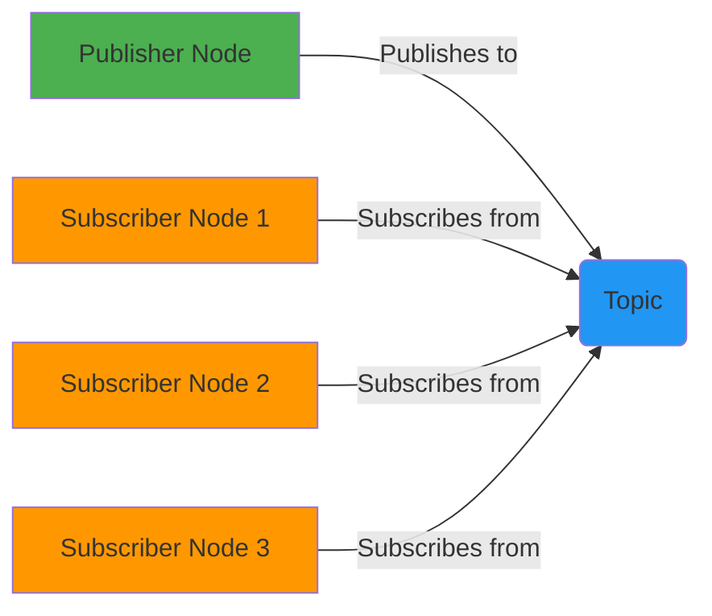
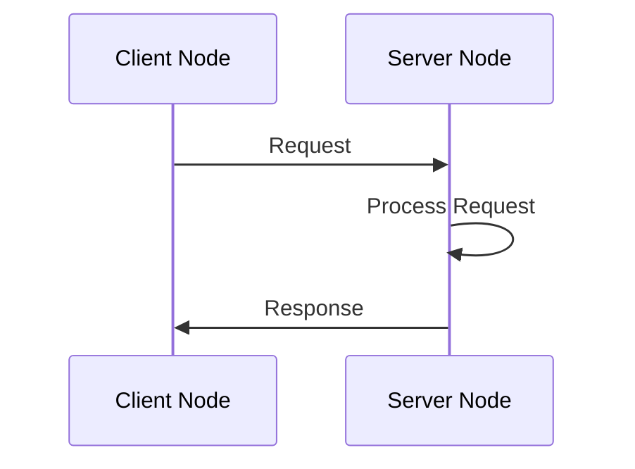

# ROS 2 Core Concepts - Nodes, Topics, and Services

## Learning Outcomes

After completing this section, you will be able to:
1. Define and distinguish between Nodes, Topics, and Services in ROS 2
2. Diagram the communication patterns between these components
3. Explain when to use Topics vs Services for different communication needs

## Introduction

In the previous section, we introduced ROS 2 as the "nervous system" of a robot. Now, let's dive deeper into the three fundamental communication concepts that make up this nervous system: Nodes, Topics, and Services.

## Nodes

A **Node** is the basic unit of computation in ROS 2. You can think of a node as a single process that performs a specific function. Nodes are designed to be modular, meaning that a robot application typically consists of many nodes that work together.

### Key Characteristics of Nodes:
- Each node runs a specific task (e.g., sensor processing, path planning, motor control)
- Nodes communicate with each other through Topics and Services
- Nodes can be written in different programming languages (C++, Python, etc.)
- Nodes are managed by the ROS 2 runtime system

## Topics

**Topics** enable asynchronous, many-to-many communication between nodes using a publish-subscribe pattern. This is the primary method for nodes to exchange data continuously.

### How Topics Work:
- Publishers send data to a Topic
- Subscribers receive data from a Topic
- Multiple publishers can send to the same Topic
- Multiple subscribers can receive from the same Topic
- Communication is asynchronous and unidirectional

### Example Use Cases:
- Sensor data (e.g., camera images, laser scans)
- Robot state information (e.g., joint positions, battery level)
- Control commands (e.g., velocity commands to motors)

```python
# Example of a simple publisher node
import rclpy
from rclpy.node import Node
from std_msgs.msg import String

class MinimalPublisher(Node):

    def __init__(self):
        super().__init__('minimal_publisher')
        self.publisher_ = self.create_publisher(String, 'topic', 10)
        timer_period = 0.5  # seconds
        self.timer = self.create_timer(timer_period, self.timer_callback)
        self.i = 0

    def timer_callback(self):
        msg = String()
        msg.data = 'Hello World: %d' % self.i
        self.publisher_.publish(msg)
        self.get_logger().info('Publishing: "%s"' % msg.data)
        self.i += 1
```

## Services

**Services** enable synchronous, request-response communication between nodes using a client-server pattern. This is used when you need to request specific information or perform an action and wait for a response.

### How Services Work:
- A service server provides a specific function
- A service client sends a request to the server
- The server processes the request and sends back a response
- Communication is synchronous and bidirectional

### Example Use Cases:
- Requesting robot pose
- Saving map data
- Changing robot parameters
- Executing specific actions

## Communication Patterns Comparison

| Aspect | Topics | Services |
|--------|--------|----------|
| Pattern | Publish-Subscribe | Client-Server |
| Synchronization | Asynchronous | Synchronous |
| Data Flow | One-way | Two-way |
| Latency | Low | Higher (due to response wait) |
| Use Case | Continuous data streams | Request-response actions |

## Diagrams





## Interactive Code Example

Here's a simple example of how nodes communicate via topics. Try modifying the values to see how the communication works:

```python
# This is a simplified representation of how you might interact with ROS 2 topics
# In a real environment, you would run this code in a ROS 2 environment

def simulate_topic_communication():
    """
    This function simulates the publish-subscribe pattern of ROS 2 topics.
    In a real ROS 2 environment, this would be implemented using rclpy.
    """
    print("Publisher: Publishing data to topic...")
    print("Subscriber 1: Received data from topic")
    print("Subscriber 2: Received data from topic")
    print("Communication is asynchronous and continuous")

simulate_topic_communication()
```

## Summary

Understanding Nodes, Topics, and Services is crucial for working with ROS 2. Topics are used for continuous data streams with a publish-subscribe model, while Services are used for request-response interactions. Nodes are the computational units that perform specific tasks and use Topics and Services to communicate with each other.

In the next section, we'll look at practical examples of implementing these concepts in Python using the rclpy library.