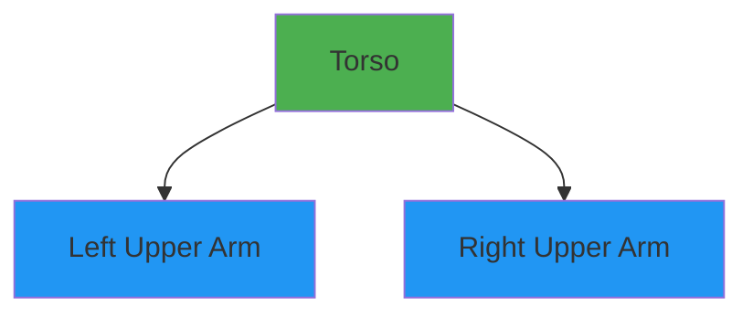

# URDF Primer - Understanding Robot Models

## Learning Outcomes

After completing this section, you will be able to:
1. Explain the purpose and structure of URDF files
2. Identify the main components of a URDF file: links, joints, and materials
3. Interpret a basic URDF file for a humanoid robot
4. Understand the relationship between URDF elements and physical robot components
5. Identify key links, joints, and sensors in a URDF file

## Introduction

URDF (Unified Robot Description Format) is an XML-based format used in ROS to describe robot models. It defines the physical and visual properties of a robot, including its links (rigid parts), joints (connections between links), and other properties such as inertial parameters, visual appearance, and collision properties.

URDF is fundamental to robotics simulation and visualization, allowing us to represent robots in simulation environments like Gazebo and visualization tools like RViz. Understanding URDF is essential for working with robot models and simulation, which is fundamental to robotics development.

## URDF Structure

A URDF file is an XML document with a specific structure. Here's the basic skeleton:

```xml
<?xml version="1.0"?>
<robot name="robot_name">
  <!-- Links define rigid bodies -->
  <link name="link_name">
    <!-- Visual properties for display -->
    <visual>
      <geometry>
        <box size="1 1 1"/>
      </geometry>
      <material name="color">
        <color rgba="1 0 0 1"/>
      </material>
    </visual>
    <!-- Collision properties for physics simulation -->
    <collision>
      <geometry>
        <box size="1 1 1"/>
      </geometry>
    </collision>
    <!-- Inertial properties for dynamics -->
    <inertial>
      <mass value="1"/>
      <inertia ixx="1" ixy="0" ixz="0" iyy="1" iyz="0" izz="1"/>
    </inertial>
  </link>

  <!-- Joints connect links -->
  <joint name="joint_name" type="revolute">
    <parent link="parent_link_name"/>
    <child link="child_link_name"/>
    <origin xyz="0 0 1" rpy="0 0 0"/>
    <axis xyz="0 0 1"/>
    <limit lower="-1.57" upper="1.57" effort="100" velocity="1"/>
  </joint>
</robot>
```

## Links

**Links** represent rigid bodies in the robot. Each link has:
- A unique name
- Visual properties (shape, color, texture) for rendering
- Collision properties (shape) for physics simulation
- Inertial properties (mass, center of mass, inertia tensor) for dynamics

### Link Components:
- **Visual**: Defines how the link looks in visualization
  - Geometry: Shape (box, cylinder, sphere, mesh)
  - Material: Color and texture
- **Collision**: Defines the collision shape for physics simulation
- **Inertial**: Defines mass properties for dynamics simulation

### Example Link:
```xml
<link name="base_link">
  <visual>
    <geometry>
      <cylinder length="0.1" radius="0.2"/>
    </geometry>
    <material name="blue">
      <color rgba="0 0 1 1"/>
    </material>
  </visual>
  <collision>
    <geometry>
      <cylinder length="0.1" radius="0.2"/>
    </geometry>
  </collision>
  <inertial>
    <mass value="10"/>
    <origin xyz="0 0 0"/>
    <inertia ixx="1.0" ixy="0.0" ixz="0.0" iyy="1.0" iyz="0.0" izz="1.0"/>
  </inertial>
</link>
```

## Joints

**Joints** define the connections between links and specify how they can move relative to each other. Each joint has:
- A unique name
- A type (fixed, revolute, continuous, prismatic, floating, planar)
- Parent and child links
- Position and orientation relative to the parent
- Movement limits (for revolute and prismatic joints)

### Joint Types:
- **Fixed**: No movement between links
- **Revolute**: Single-axis rotation with limits
- **Continuous**: Single-axis rotation without limits
- **Prismatic**: Single-axis translation with limits
- **Floating**: Six degrees of freedom
- **Planar**: Motion on a plane

### Example Joint:
```xml
<joint name="base_to_wheel" type="continuous">
  <parent link="base_link"/>
  <child link="wheel_link"/>
  <origin xyz="0.1 0.2 0" rpy="0 0 0"/>
  <axis xyz="0 0 1"/>
</joint>
```

## Materials

**Materials** define the visual appearance of links, including color and texture. They can be defined once and reused across multiple links.

### Example Material:
```xml
<material name="red">
  <color rgba="1 0 0 1"/>
</material>
```

## Complete URDF Example

Here's a simple humanoid model with a torso and two arms:

```xml
<?xml version="1.0"?>
<robot name="simple_humanoid">

  <!-- Base link -->
  <link name="torso">
    <visual>
      <geometry>
        <box size="0.3 0.3 0.6"/>
      </geometry>
      <material name="white">
        <color rgba="1 1 1 1"/>
      </material>
    </visual>
    <collision>
      <geometry>
        <box size="0.3 0.3 0.6"/>
      </geometry>
    </collision>
    <inertial>
      <mass value="5"/>
      <inertia ixx="0.1" ixy="0" ixz="0" iyy="0.1" iyz="0" izz="0.1"/>
    </inertial>
  </link>

  <!-- Left Arm -->
  <link name="left_upper_arm">
    <visual>
      <geometry>
        <cylinder length="0.3" radius="0.05"/>
      </geometry>
      <material name="gray">
        <color rgba="0.5 0.5 0.5 1"/>
      </material>
    </visual>
    <collision>
      <geometry>
        <cylinder length="0.3" radius="0.05"/>
      </geometry>
    </collision>
    <inertial>
      <mass value="1"/>
      <inertia ixx="0.01" ixy="0" ixz="0" iyy="0.01" iyz="0" izz="0.01"/>
    </inertial>
  </link>

  <!-- Right Arm -->
  <link name="right_upper_arm">
    <visual>
      <geometry>
        <cylinder length="0.3" radius="0.05"/>
      </geometry>
      <material name="gray">
        <color rgba="0.5 0.5 0.5 1"/>
      </material>
    </visual>
    <collision>
      <geometry>
        <cylinder length="0.3" radius="0.05"/>
      </geometry>
    </collision>
    <inertial>
      <mass value="1"/>
      <inertia ixx="0.01" ixy="0" ixz="0" iyy="0.01" iyz="0" izz="0.01"/>
    </inertial>
  </link>

  <!-- Joints connecting the arms to the torso -->
  <joint name="left_shoulder_joint" type="revolute">
    <parent link="torso"/>
    <child link="left_upper_arm"/>
    <origin xyz="0.2 0.15 0" rpy="0 0 0"/>
    <axis xyz="0 1 0"/>
    <limit lower="-1.57" upper="1.57" effort="100" velocity="1"/>
  </joint>

  <joint name="right_shoulder_joint" type="revolute">
    <parent link="torso"/>
    <child link="right_upper_arm"/>
    <origin xyz="0.2 -0.15 0" rpy="0 0 0"/>
    <axis xyz="0 1 0"/>
    <limit lower="-1.57" upper="1.57" effort="100" velocity="1"/>
  </joint>

</robot>
```

## Interpreting URDF Files

When interpreting a URDF file, focus on:

1. **Links**: Identify the rigid bodies that make up the robot
   - Look for visual/collision geometries
   - Note the names of important links (base, end effectors, etc.)

2. **Joints**: Understand how links are connected and how they move
   - Note joint types (rotational, linear, fixed)
   - Check joint limits and ranges of motion

3. **Hierarchy**: Trace the kinematic chain from base to end effectors
   - Every link (except the base) has exactly one parent
   - Multiple children are possible (branching structures)

4. **Sensors**: Look for sensor plugins or special links representing sensors
   - Camera, IMU, LiDAR sensors often have dedicated links

## Visualization with Mermaid

Here's a tree representation of the simple humanoid model:



## Common URDF Issues and Troubleshooting

1. **Invalid XML**: Check for proper closing tags and correct syntax
2. **Duplicate names**: All links and joints must have unique names
3. **Disconnected links**: Every link (except base) must have exactly one parent
4. **Missing geometries**: Both visual and collision elements need geometry
5. **Inconsistent units**: Use consistent units (usually meters for distances)

## Best Practices

- Use descriptive names for links and joints
- Organize the file logically (base first, then appendages)
- Include comments for complex sections
- Use consistent units throughout
- Validate the URDF using tools like `check_urdf`

## Summary

URDF is a fundamental format in ROS for describing robot models. Understanding its structure - links, joints, and materials - is essential for working with robot simulations and visualizations. The hierarchical structure of links and joints allows for the representation of complex robots with multiple degrees of freedom.

In the next section, we'll look at how to create effective assessments for testing your understanding of these concepts.