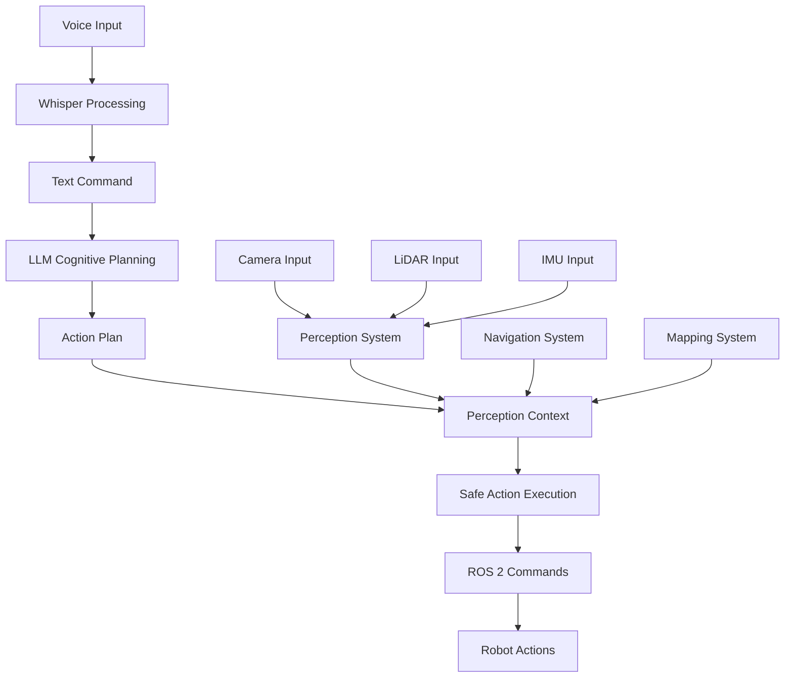

# VLA Integration Pipeline

This section covers the complete end-to-end pipeline from voice input through LLM planning to perception-informed action execution.

## Complete VLA Architecture

The Vision-Language-Action system integrates all previous modules:



## Complete VLA Node Implementation

```python
import rclpy
from rclpy.node import Node
from std_msgs.msg import String, Bool
from sensor_msgs.msg import Image, LaserScan
from geometry_msgs.msg import Twist, Pose
import whisper
import json
import threading
import queue

class VLAPipeline(Node):
    def __init__(self):
        super().__init__('vla_pipeline')

        # Voice processing components
        self.whisper_model = whisper.load_model("base")
        self.voice_queue = queue.Queue()

        # Publishers
        self.cmd_vel_pub = self.create_publisher(Twist, '/cmd_vel', 10)
        self.action_pub = self.create_publisher(String, '/robot_action', 10)
        self.status_pub = self.create_publisher(String, '/vla_status', 10)

        # Subscriptions
        self.voice_sub = self.create_subscription(
            String, '/audio_text', self.voice_callback, 10
        )
        self.perception_sub = self.create_subscription(
            String, '/perception_data', self.perception_callback, 10
        )
        self.image_sub = self.create_subscription(
            Image, '/camera/image_raw', self.image_callback, 10
        )

        # Internal state
        self.current_perception = {}
        self.is_processing = False

        # Start voice processing thread
        self.voice_thread = threading.Thread(target=self.process_voice_commands, daemon=True)
        self.voice_thread.start()

        self.get_logger().info("VLA Pipeline initialized")

    def voice_callback(self, msg):
        """Handle incoming voice commands"""
        self.voice_queue.put(msg.data)

    def perception_callback(self, msg):
        """Update perception context"""
        try:
            self.current_perception = json.loads(msg.data)
        except json.JSONDecodeError:
            self.get_logger().error("Failed to parse perception data")

    def image_callback(self, msg):
        """Process camera data for visual perception"""
        # In a real system, this would feed into perception pipeline
        pass

    def process_voice_commands(self):
        """Process voice commands in a separate thread"""
        while rclpy.ok():
            try:
                if not self.voice_queue.empty():
                    command = self.voice_queue.get(timeout=0.1)
                    self.process_command(command)
            except queue.Empty:
                continue

    def process_command(self, command_text):
        """Process a single command through the VLA pipeline"""
        if self.is_processing:
            self.get_logger().warn("Already processing a command, skipping")
            return

        self.is_processing = True
        self.publish_status("Processing command: " + command_text)

        try:
            # Step 1: Cognitive planning with LLM
            action_plan = self.cognitive_planning(command_text)

            # Step 2: Integrate perception context
            contextualized_plan = self.integrate_perception(action_plan)

            # Step 3: Execute plan safely
            success = self.execute_plan(contextualized_plan)

            if success:
                self.publish_status("Command completed successfully")
            else:
                self.publish_status("Command execution failed")

        except Exception as e:
            self.get_logger().error(f"Error processing command: {e}")
            self.publish_status(f"Error: {str(e)}")
        finally:
            self.is_processing = False

    def cognitive_planning(self, command):
        """Use LLM to decompose the command into actions"""
        # This would integrate with your LLM client
        # For this example, we'll use a simple rule-based approach
        command = command.lower()

        if "clean the room" in command:
            return [
                {"action": "detect_objects", "params": {"object_type": "trash"}},
                {"action": "navigate_to_object", "params": {"object_id": "detected_trash"}},
                {"action": "grasp_object", "params": {"object_id": "detected_trash"}},
                {"action": "navigate_to", "params": {"location": "trash_bin"}},
                {"action": "release_object", "params": {"object_id": "detected_trash"}}
            ]
        elif "move forward" in command:
            return [
                {"action": "move_forward", "params": {"distance": 1.0}}
            ]
        else:
            return [
                {"action": "unknown_command", "params": {"command": command}}
            ]

    def integrate_perception(self, action_plan):
        """Integrate current perception data into the action plan"""
        contextualized_plan = []

        for action in action_plan:
            if action["action"] == "navigate_to_object" and "object_id" in action["params"]:
                # Update object location based on current perception
                object_id = action["params"]["object_id"]
                if object_id in self.current_perception.get("objects", {}):
                    obj_pose = self.current_perception["objects"][object_id]["pose"]
                    action["params"]["target_pose"] = obj_pose

            contextualized_plan.append(action)

        return contextualized_plan

    def execute_plan(self, action_plan):
        """Execute the action plan safely"""
        for action in action_plan:
            if not self.execute_single_action(action):
                self.get_logger().error(f"Failed to execute action: {action}")
                return False

        return True

    def execute_single_action(self, action):
        """Execute a single action with safety checks"""
        action_type = action["action"]

        # Safety validation
        if not self.validate_action(action):
            return False

        # Execute based on action type
        if action_type == "move_forward":
            return self.execute_move_forward(action["params"])
        elif action_type == "turn_left":
            return self.execute_turn(action["params"], direction=1)
        elif action_type == "turn_right":
            return self.execute_turn(action["params"], direction=-1)
        elif action_type == "navigate_to":
            return self.execute_navigate_to(action["params"])
        elif action_type == "grasp_object":
            return self.execute_grasp(action["params"])
        elif action_type == "release_object":
            return self.execute_release(action["params"])
        else:
            self.get_logger().warn(f"Unknown action type: {action_type}")
            return False

    def validate_action(self, action):
        """Validate action against safety constraints"""
        # Check if action is safe to execute
        # This would include collision checking, kinematic limits, etc.
        return True  # Simplified for example

    def execute_move_forward(self, params):
        """Execute forward movement"""
        twist = Twist()
        twist.linear.x = params.get("distance", 1.0)
        self.cmd_vel_pub.publish(twist)
        return True

    def execute_turn(self, params, direction):
        """Execute turn action"""
        twist = Twist()
        twist.angular.z = direction * params.get("angle", 0.5)
        self.cmd_vel_pub.publish(twist)
        return True

    def execute_navigate_to(self, params):
        """Execute navigation to a location"""
        # This would integrate with Nav2 from Module 3
        return True

    def execute_grasp(self, params):
        """Execute grasping action"""
        # This would control manipulator if available
        return True

    def execute_release(self, params):
        """Execute release action"""
        # This would control manipulator if available
        return True

    def publish_status(self, status):
        """Publish status message"""
        status_msg = String()
        status_msg.data = status
        self.status_pub.publish(status_msg)

def main():
    rclpy.init()
    vla_pipeline = VLAPipeline()

    try:
        rclpy.spin(vla_pipeline)
    except KeyboardInterrupt:
        pass
    finally:
        vla_pipeline.destroy_node()
        rclpy.shutdown()

if __name__ == '__main__':
    main()
```

## Launch File for VLA System

```xml
<!-- launch/vla_system.launch.py -->
from launch import LaunchDescription
from launch_ros.actions import Node
from ament_index_python.packages import get_package_share_directory
import os

def generate_launch_description():
    return LaunchDescription([
        # Voice processing node
        Node(
            package='voice_processing',
            executable='voice_to_text',
            name='voice_to_text',
            parameters=[
                {'model_size': 'base'},
                {'sample_rate': 16000}
            ]
        ),

        # Perception system (from Module 3)
        Node(
            package='perception_system',
            executable='perception_node',
            name='perception_node'
        ),

        # Navigation system (from Module 3)
        Node(
            package='nav2',
            executable='nav2_node',
            name='nav2_node'
        ),

        # VLA integration pipeline
        Node(
            package='vla_system',
            executable='vla_pipeline',
            name='vla_pipeline',
            parameters=[
                {'use_sim_time': True}
            ]
        )
    ])
```

## Performance Monitoring

Monitoring the VLA system performance:

```python
class VLAMonitor(Node):
    def __init__(self):
        super().__init__('vla_monitor')

        # Subscriptions to monitor system performance
        self.status_sub = self.create_subscription(
            String, '/vla_status', self.status_callback, 10
        )

        self.command_sub = self.create_subscription(
            String, '/voice_command', self.command_received, 10
        )

        self.action_sub = self.create_subscription(
            String, '/robot_action', self.action_executed, 10
        )

        # Performance metrics
        self.command_count = 0
        self.success_count = 0
        self.error_count = 0

        # Timer for periodic reporting
        self.timer = self.create_timer(10.0, self.report_performance)

    def status_callback(self, msg):
        if "completed successfully" in msg.data.lower():
            self.success_count += 1
        elif "error" in msg.data.lower() or "failed" in msg.data.lower():
            self.error_count += 1

    def command_received(self, msg):
        self.command_count += 1

    def action_executed(self, msg):
        # Track action execution
        pass

    def report_performance(self):
        """Report system performance metrics"""
        if self.command_count > 0:
            success_rate = (self.success_count / self.command_count) * 100
            self.get_logger().info(
                f"VLA Performance - Commands: {self.command_count}, "
                f"Success: {self.success_count}, "
                f"Errors: {self.error_count}, "
                f"Success Rate: {success_rate:.1f}%"
            )
```

## Best Practices for VLA Integration

1. **Modularity**: Keep components loosely coupled for easier maintenance
2. **Safety First**: Implement multiple safety layers and validation steps
3. **Error Handling**: Graceful degradation when components fail
4. **Performance**: Monitor and optimize the end-to-end pipeline
5. **Testing**: Extensive testing with various command types and scenarios
6. **Logging**: Comprehensive logging for debugging and analysis
7. **Scalability**: Design for adding new capabilities over time